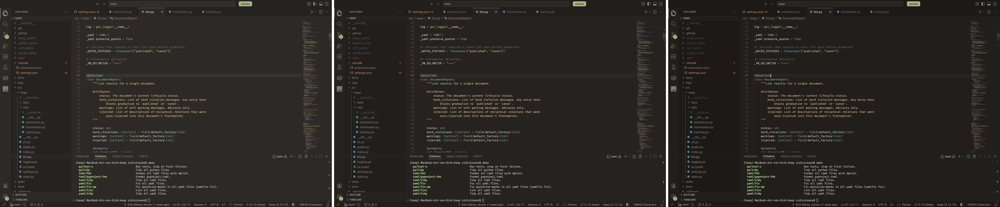
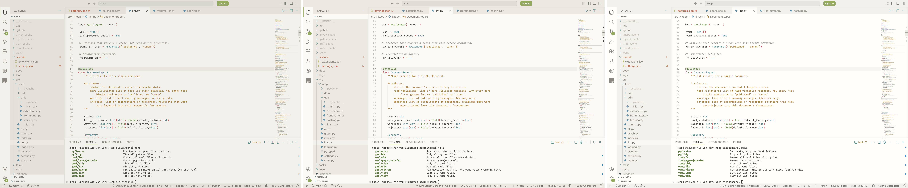

# Humanuals Theme

A VS Code theme for dark and light variants rooted in Anthropic's design
palette.

## Variants

Dark and light. Each independently configurable along two axes:

- **Temperature** — `cool`, `neutral` (default), `warm`
- **Contrast** — `soft`, `balanced` (default), `crisp`

Mix freely — warm dark with cool light, for instance.

## Configuration

Settings are available under `humanualsTheme` in VS Code. In addition to
temperature and contrast, cursor color, selection color, italic comments and
italic keywords are configurable per mode.

## Installation

Search for **Humanuals Theme** in the VS Code Extensions panel or install via
the
[VS Code Marketplace](https://marketplace.visualstudio.com/items?itemName=sidisinsane.humanuals-theme)
or
[Open VSX Registry](https://open-vsx.org/extension/sidisinsane/humanuals-theme).

## Acknowledgements

Thanks to [Sainnhe Park](https://github.com/sainnhe) for abandoning his great
[everforest-vscode](https://github.com/sainnhe/everforest-vscode) theme and
therefore leaving me no other choice but to create my own;
[Anthropic](https://www.anthropic.com/) for being so tasteful and
[Claude](https://claude.ai/) for being so helpful.
